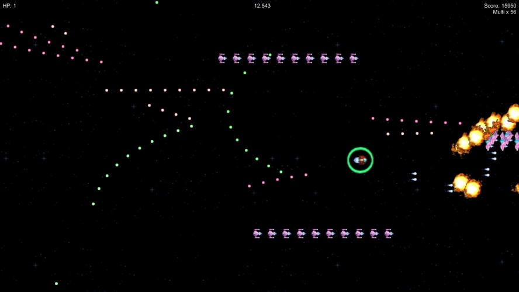

# Ikarauraga
> A ripoff of Ikaruga made for Ludum Dare 35.

## Authors
- Clément Stéphano &ndash; Sounds, game design & development
- Maxime Le Conte des Floris &ndash; Development

## Special thanks
- Luis Zuno ([@ansimuz](https://twitter.com/ansimuz)) for most the assets.

## License
Everything in the `Assets/Scripts` and `Assets/Sounds` folders are licensed under the CC0 license. Feel free to use them! 
